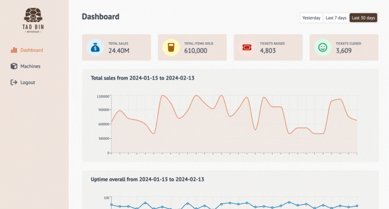

# Taobin Web Admin

## Overview

Taobin Admin is an administrative console designed to monitor overall sales, tickets, and uptime. Administrators can also manage machine information and configurations directly from this system, ensuring efficient operation and maintenance of the service infrastructure.



## Live demo

[Link to demo](https://taobin-admin-lauv-test.netlify.app)

## Framework & Modules

-   React with Vite
-   React Query
-   Recharts
-   Styled Components
-   Supabase

## Local Setup Instructions

To set up the Taobin Admin project locally, follow these steps:

1. Install project dependencies by running:

```bash
npm install
```

2. Start the development server by executing:

```bash
npm run dev
```

3. Open a web browser and navigate to http://localhost:5173 or to the port specified by your local settings.

4. To generate mock data for development testing:

-   Navigate to the src/data/ directory.
-   Run the following command in your terminal:

```bash
node dataGenerator.js
```

-   This script generates mock data in CSV format, which can be uploaded to the database (currently configured for Supabase).

## Deployment Instructions

To deploy the Taobin Admin application, follow these steps:

1. Build the project for production by running:

```bash
npm run build
```

2. Follow your hosting provider's instructions to deploy the built application.

## Note

-   Pre-requisite: Ensure your environment is properly configured for Node.js development.

-   Non-Editable Fields: Some fields in the web admin console cannot be edited. They are planned to integrate with an external system to maintain data accuracy.

-   Authentication: Currently, it's a mock login page. No actual account is required.

-   Mock Data: Mock data are manually generated to help simulate system activity and assist in admin review. This mock data can be uploaded to a database server, currently Supabase.
